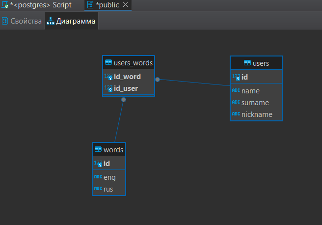

# Курсовая работа «ТГ-чат-бот «Обучалка английскому языку»» по курсу «Базы данных»

#### Схема БД

___
Мануал для работы с ботом, пожалуйста выполните все пукнты в указанном порядке:

__1.__ Откройте файл [password.ini](password.ini) и добавьте поочередно:
- name_bd = 'название вашей базы данных'
- password = 'пароль от вашей базы данных'
- token = 'ваш токен от Telegramm бота'
 
 Не забудьте сохранить файл перед началом работы.

__2.__ Запустите файл [create_bd.py](create_bd.py) для создания стартовой базы (будут созданы таблицы указанные на схеме), а также добавлено 10 базовых слов.

##### ВНИМАНИЕ!
Если вы закроете файл и снова его запустите стартовая база данных будет создана снова! Это сделано для полной очистки БД от данных, записанных в процессе выполнения программы:
Слова, добавленные пользователями и данные о пользователях.

__3.__ Запустите файл [main.py](main.py). При этом происходит подключение по указанным вами данных из файла password.ini. При возникновении ошибок подключения пожалуйста проверьте данные.

__4.__ Запускаете Telegram-бота командой "/start" или "/s".

__5.__ Бот предлагает вам перевести слово на русском языке, для этого надо выбрать кнопку которая соответствует правильному переводу, при неверном ответе предлагается сделать еще одну попытку. После указания правильного перевода можно перейти к следующему слову кнопкой "Далее".

__6.__ Добавление нового слова:
Также в боте предусмотрена возможность добавить новое слово в словарь, для этого необходимо нажать на кнопку "ДОБАВИТЬ СЛОВО", после переходим к добавлению в таблицу своей пары слов: слово на английском языке - его перевод на русском языке. 

##### ВНИМАНИЕ!
Вставлять слова необходимо через пробел!
Обратите внимание, что добавить можно только те слова, которые отсутствуют в базе данных. Если такое слово уже есть в базе данных, оно не добавится повторно.

__7.__ Удаление слова:
Для того чтобы удалить слово нажмите на кнопку "УДАЛИТЬ СЛОВО", будет осуществлен переход к удалению из таблицы пары слов: слово на английском языке - его перевод на русском языке. Для этого вставляем удаляемое слово на русском __ИЛИ__ английском языке.

##### ВНИМАНИЕ!
Пользователь может удалить только те пары слов, которые добавил сам.
___
## Состав проекта:

- [password.ini](password.ini) - файл для добавление пользовательской информации.
- [create_bd.py](create_bd.py) - создание стартовой БД и набора из 10 слов.
- [main.py](main.py) - файл для подключения и работы Telegram-бота.
- [work_bd.py](work_bd.py) - файл для работы с БД (добавление пользователей, выбор случайных слов и ответов, добавление и удаление слов)
- [requirements.txt](requirements.txt) - файл с зависимостями.
- [manual.md](manual.md) - документация по использованию программы.
- [checking_tasks.md](checking_tasks.md) - файл для проверки соответствия поставленному ТЗ.
